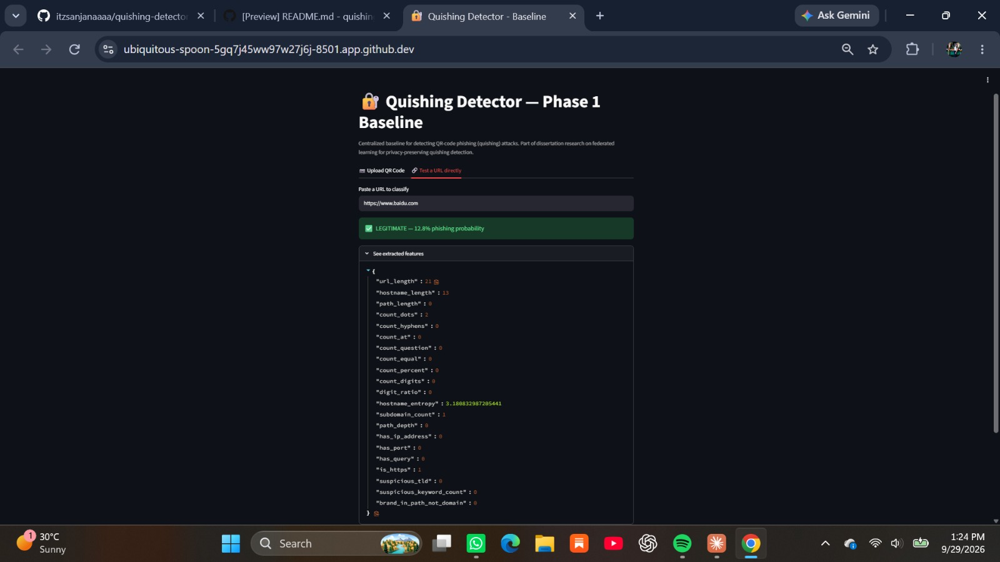
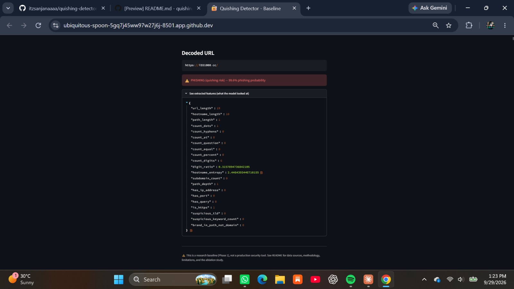
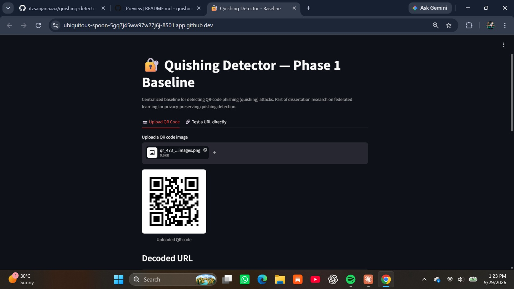
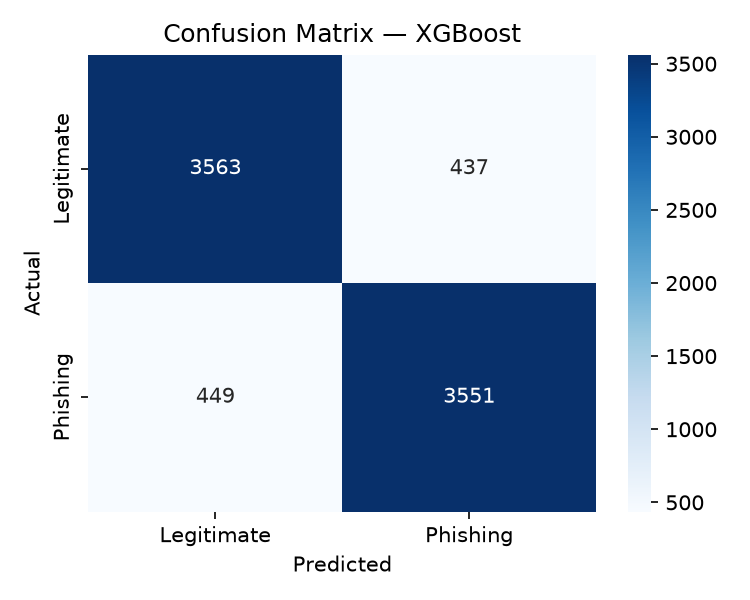
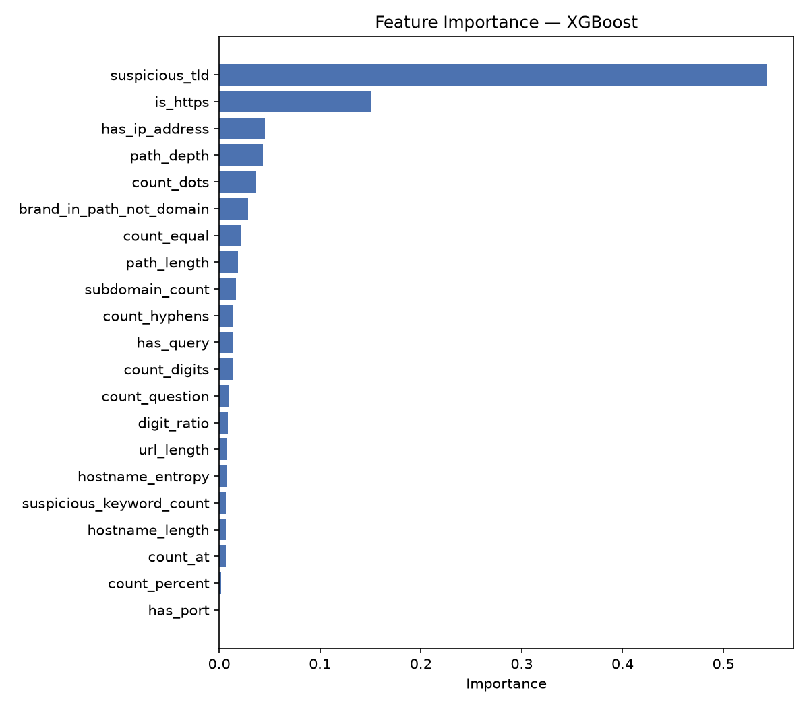

# Quishing Detector — Baseline

A QR-code phishing ("quishing") detector. Decodes a QR code image, extracts
lexical/structural features from the embedded URL, and classifies it as
phishing or legitimate using a trained machine learning model.

## What this does

1. Decodes a QR code image to extract the embedded URL (`src/02_qr_decoder.py`)
2. Extracts 21 lexical/structural features from the URL — length, character
   composition, entropy, TLD reputation, brand-mimicry patterns, and more
   (`src/03_feature_extraction.py`)
3. Classifies the URL as phishing or legitimate using a Random Forest /
   XGBoost baseline classifier (`src/04_train_model.py`)
4. End-to-end inference: image or raw URL in, verdict out (`src/05_predict.py`)
5. Interactive Streamlit demo (`app.py`)

## Data sources

| Class | Source | Notes |
|---|---|---|
| Phishing | [JPCERT/CC phishing URL list](https://github.com/JPCERTCC/phishurl-list) | Official CERT-maintained dataset, 2022–2026, includes target-brand labels |
| Legitimate | [Cisco Umbrella Top Domains](https://github.com/cjbarker/top-domains) | Top 100K domains by DNS popularity |
| Path realism | [ISCX-2016-derived legitimate URL crawl](https://github.com/chamanthmvs/Phishing-Website-Detection) | Used to sample realistic paths onto legitimate domains (see Limitations) |

Run `scripts/00_download_data.sh` to fetch all raw sources, then:
```bash
python3 src/01_build_dataset.py
python3 src/01b_enrich_legitimate_urls.py
python3 src/03_feature_extraction.py
python3 src/04_train_model.py
```

## Usage

**Classify a QR code image:**
```bash
python src/05_predict.py --image samples/sample_phishing_qr.png
python src/05_predict.py --image samples/sample_legitimate_qr.png
```

**Classify a raw URL directly (skip QR decoding):**
```bash
python src/05_predict.py --url "https://paypal-secure-login.top/verify/account"
```

**Interactive demo (upload a QR image or paste a URL in the browser):**
```bash
streamlit run app.py
```
   
   *baidu.com correctly classified as legitimate (12.8% phishing probability)*

   
   *A quishing URL correctly flagged (99.6% phishing probability)*

   
   *Classification via QR code image upload*

## Project structure

```
quishing-detector-baseline/
├── app.py                          # Streamlit interactive demo
├── src/
│   ├── 01_build_dataset.py         # Combine JPCERT + Umbrella sources
│   ├── 01b_enrich_legitimate_urls.py  # Fix path-length artifact (see Limitations)
│   ├── 02_qr_decoder.py            # QR image -> URL
│   ├── 03_feature_extraction.py    # URL -> 21 lexical/structural features
│   ├── 04_train_model.py           # Train + evaluate + ablation study
│   └── 05_predict.py               # End-to-end inference (image/URL -> verdict)
├── scripts/00_download_data.sh     # Reproduce raw data from source
├── samples/                        # Example QR codes for quick testing
├── data/processed/                 # Final dataset + features (included)
├── models/best_model.joblib        # Trained XGBoost classifier
├── results/                        # Metrics, confusion matrix, feature importance
└── README.md
```

## Setup

```bash
pip install -r requirements.txt
```

QR decoding uses OpenCV (already in requirements) — no external native library
required. `pyzbar` is an optional secondary backend; see Troubleshooting.

## Troubleshooting

**Windows: `FileNotFoundError: Could not find module 'libzbar-64.dll'`**
The QR decoder (`src/02_qr_decoder.py`) uses **OpenCV as the primary
backend**, which has no external native-library dependency. `pyzbar` is only
an optional secondary backend and is skipped automatically if it — or its
underlying `libzbar-64.dll` — fails to load. `requirements.txt` does not
install `pyzbar` by default for this reason.

## Results

Baseline trained on 40,000 URLs (20K phishing / 20K legitimate, 80/20 train/test split).

| Metric | Random Forest | XGBoost (selected) |
|---|---|---|
| Accuracy | 88.80% | **88.92%** |
| Precision | 88.92% | **89.04%** |
| Recall | 88.65% | **88.78%** |
| F1 | 88.78% | **88.91%** |
| ROC-AUC | 0.9577 | **0.9622** |




### Robustness check (feature ablation)

The top feature, `suspicious_tld`, accounted for 54% of total feature
importance. To check the model isn't overly reliant on this one signal, it
was removed and the model retrained from scratch:

| | With `suspicious_tld` | Without `suspicious_tld` |
|---|---|---|
| Accuracy | 88.92% | 85.22% |
| F1 | 88.91% | 85.56% |
| ROC-AUC | 0.9622 | 0.9354 |

Performance drops but stays well above chance, confirming the remaining 20
features carry genuine, distributed signal.

## Limitations

- **Legitimate URL paths are resampled, not per-domain crawled.** The
  legitimate domain list only provides bare domains, so realistic paths were
  sampled from a separate small crawled corpus and applied to those domains,
  rather than crawling each domain's real pages directly. A stronger
  follow-up would crawl real per-domain page URLs.
- **URL lexical/structural features only** — no visual QR-image tampering
  detection, no live domain reputation lookups (WHOIS age, DNS, SSL
  certificate issuance date).
- Results are on a held-out test split from the same distribution as
  training data; performance on out-of-distribution or adversarially crafted
  URLs is untested.

  ## Roadmap
This baseline uses centralised training on a single combined dataset. Next steps:
- Test cross-dataset generalisation (train on JPCERT, evaluate on a held-out
  phishing feed to check for distribution shift)
- Extend to a federated learning setup, where multiple clients (e.g. simulated
  organisations) train locally on private URL data and share only model
  updates — the basis of my ongoing dissertation, "Quishing Detection and
  Prevention Using Federated Learning"

## Related Work and Attribution

This project is an independent research implementation and baseline for
machine-learning-based quishing detection.

The project is informed by prior research and open-source work in QR-code
and quishing detection, including:

- Trad, F. and Chehab, A., "Detecting Quishing Attacks with Machine Learning
  Techniques Through QR Code Analysis":
  https://github.com/fouadtrad/Detecting-Quishing-Attacks-with-Machine-Learning-Techniques-Through-QR-Code-Analysis

- QShing Guard:
  https://github.com/Navy10021/qshing_guard

These works are acknowledged as related research. This repository does not
claim ownership of third-party code, datasets, research results, or other
external materials.

## How this was built
I designed the project scope, selected the data sources, and directed the
experiments — including the feature ablation and the path-resampling fix
described in Limitations. I used an AI assistant for code
generation, debugging, and documentation drafting. I reviewed, ran, and can
explain every component in this repository.

### Third-Party Resources

The datasets and external resources referenced in this repository remain
subject to their respective licenses and terms. Users should consult the
original sources before redistributing third-party materials.

The MIT License applies to the original code in this repository to the extent
that the author has the right to license that code under MIT.

## License

MIT
